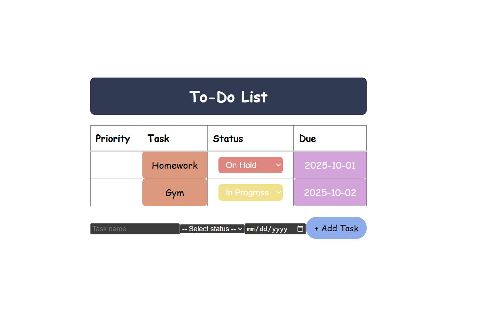
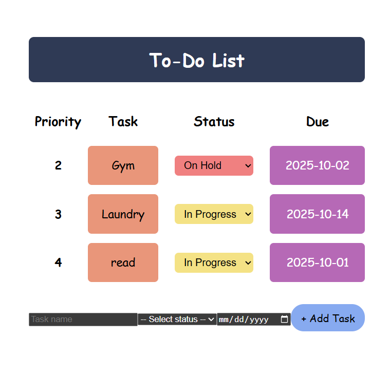

# to-do-list

## Mockup

Creating a to-do list in React.
I started by sketching a mockup of my To-Do List app. This shows the main features:

- A header with the app title
- A table with columns for Priority, Task, Status, and Due date
- A button to add new tasks

## Component Hierarchy

Based on the mockup, I broke the UI into components using the single responsibility principle:
ToDoApp – the root container for the entire application.  
Header – displays the title “To-do list”.  
ToDoTable – wraps the table of tasks.  
TableHead – column headers (Priority, Task, Status, Due).  
TaskDetailRow – one row per task, containing: Priority, Task, Status, Due  
AddTaskButton – button at the bottom to add new tasks.  

## Static Version 

I built a static version of the app in React.

- The data is currently hardcoded inside the `ToDoTable` component.
- In the future, the data will move up into `ToDoApp` so it can be managed with state and passed down as props.
- `ToDoTable` renders the `<table>` with rows.
- `TableHead` renders the header row.
- `TaskDetailRow` renders each row using props.
- `AddTaskButton` renders a button (not yet interactive).

To decide what should be state, I followed the React guideline questions:

1. Is it passed in via props? → Then it’s not state.
2. Does it remain unchanged over time? → Then it’s not state.
3. Can it be derived from something else? → Then it’s not state.

In my To-Do app, the pieces of data are:

- The list of tasks
- Whether a task is done
- The text of a new task (when adding one)
- The table headers

From these, the **minimal state** is:

- `tasks`: an array of task objects (`{ id, priority, name, status, due }`)
- `newTask` input values: the data for a task being added (name, status, due).

Everything else can be derived from this state.  
For example, priority can be derived from the order of tasks in the array,  
and the table headers are static so they don’t need to be stored in state.

## Identifying where state should live

After identifying the minimal state, the next step was to decide which component should own it.

- **tasks**: Both the `ToDoTable` (to render tasks) and the add task form/button (to add tasks) need access to this data. The closest common parent is `ToDoApp`. Therefore, the `tasks` state will live in `ToDoApp` and be passed down as props to child components. For example, `ToDoApp` will pass `tasks` into `ToDoTable`.

- **newTask inputs**: The temporary input values for adding a new task (name, status, due) are only needed while the user is typing. They can live locally in the add task form component. When the form is submitted, the new task will be sent up to `ToDoApp` using a callback, which will then update the `tasks` array state.

Derived values such as task priority or whether a task is “done” should not be stored in state. They can be computed dynamically:

- Task priority = the order of the array (`index + 1`).
- Completed tasks = filter tasks where `status !== "done"`. So completed task gets removed.

For generating unique task IDs I used `Date.now()`, and for selecting due dates I used
the `<input type="date">` element. I learned both from MDN Web Docs.

## Implementing State and Interactivity

Once I had the minimal state and its ownership set up, I implemented the logic to make the app interactive and progressively refined the styling.

### State & Interactivity

- I moved the hardcoded tasks into state using useState in ToDoApp.
- Added handleAddTask and handleStatusChange to let child components update state.
- Used callbacks (onAddTask, onStatusChange) passed as props so data could flow back up.
- Tasks update or get removed when status changes to "Done".
- Adding a task generates a unique id with Date.now() (reference: MDN Web Docs).

### Styling Process

1. **Initial styling (plain table)**

   - At first, I used a plain <table border="1"> with default borders.
   - This was useful for debugging, since I could clearly see the rows and columns.

   

2. **Removed borders & added spacing**

   - I removed table borders (border: none) and added border-spacing for space between rows.

3. **Colored & rounded cells**

   - Task = orange
   - Status = green(done), yellow(in progress), or red(On hold) depending on value
   - Due date = purple
   - Rounded corners gave each cell a card-like look.

### Additional Update: Priority

- In the static version, task priority was assigned based on the order tasks were added (`tasks.length + 1`).
- In the final version, I updated it so that **priority is determined by the task’s due date**.
- Tasks are now sorted by earliest due date first, and the priority numbers are recalculated dynamically (`index + 1`) when rendering the list.

## Final Product

